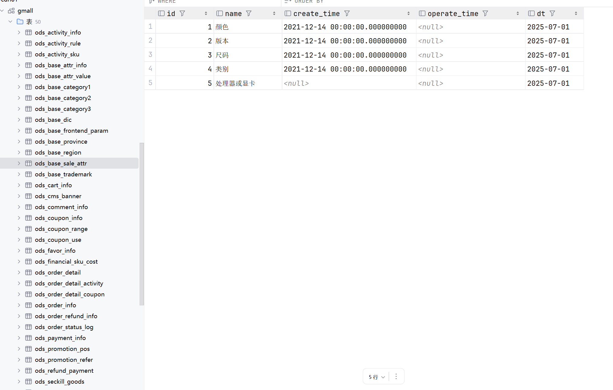
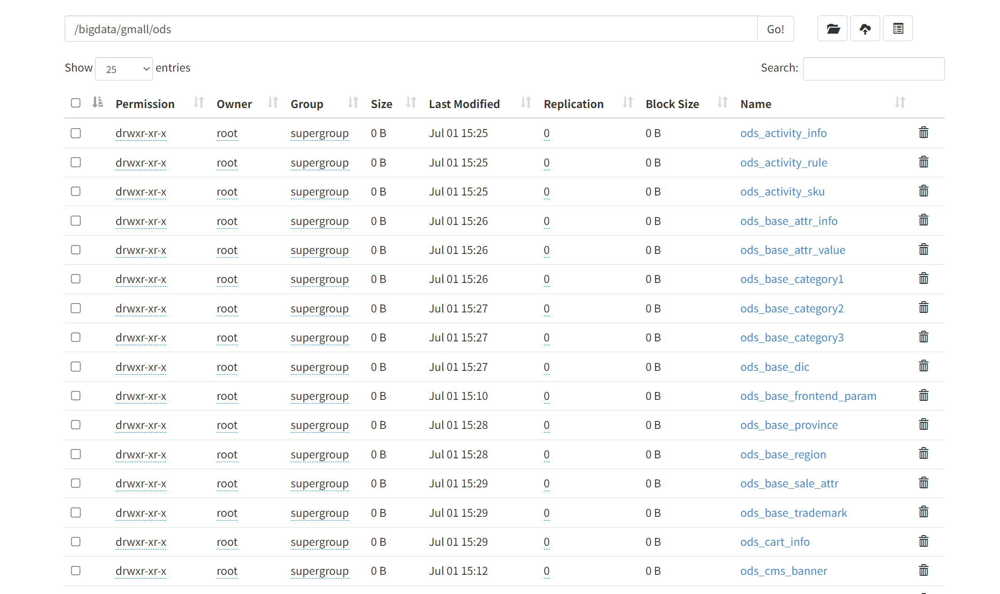
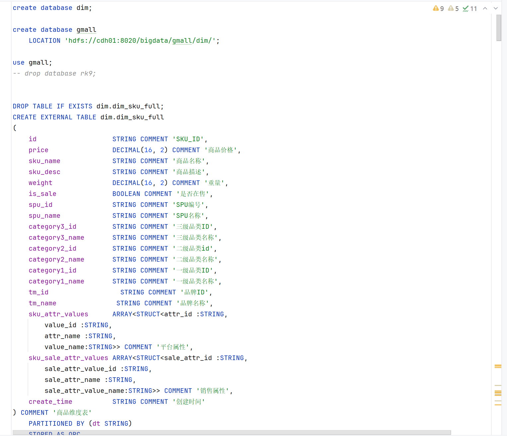
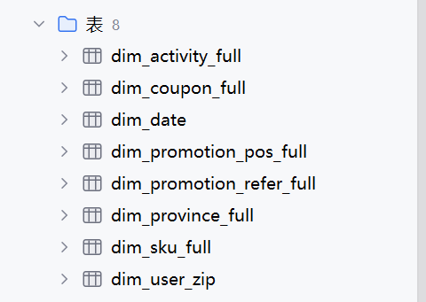
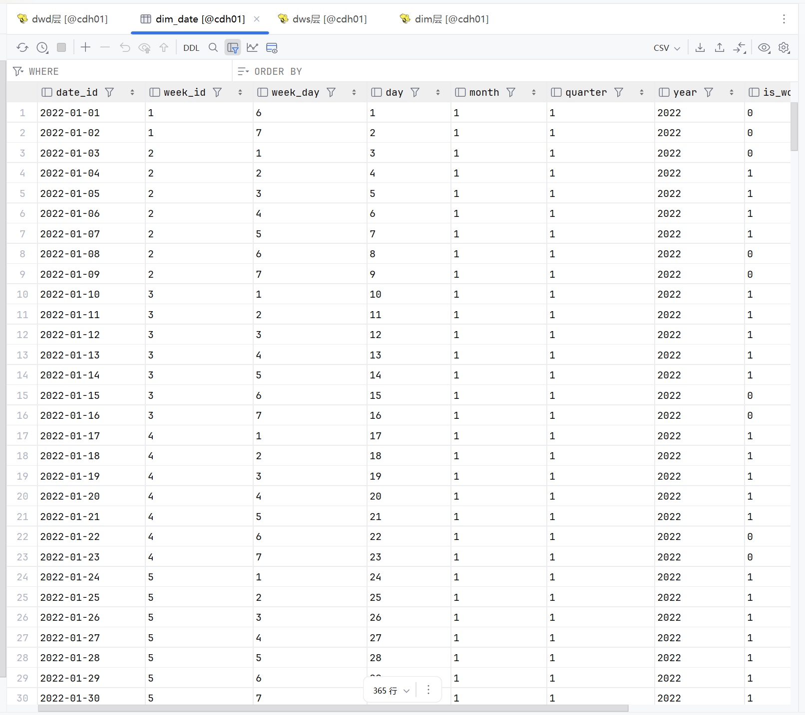
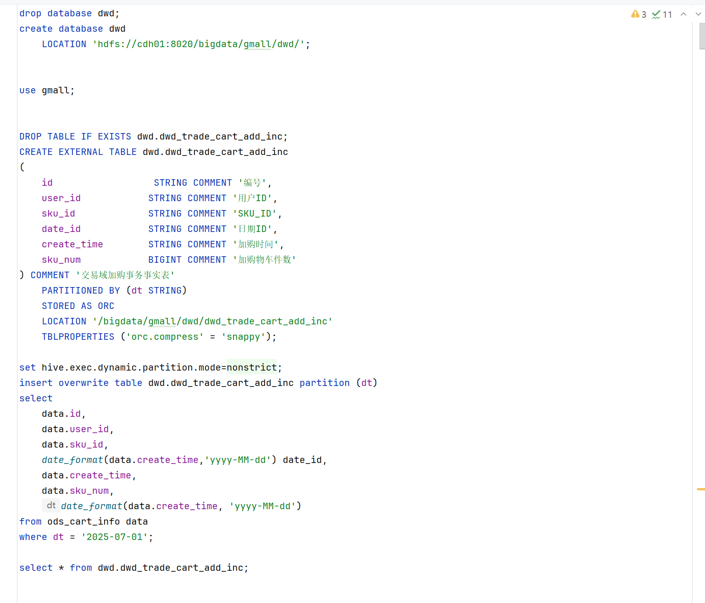
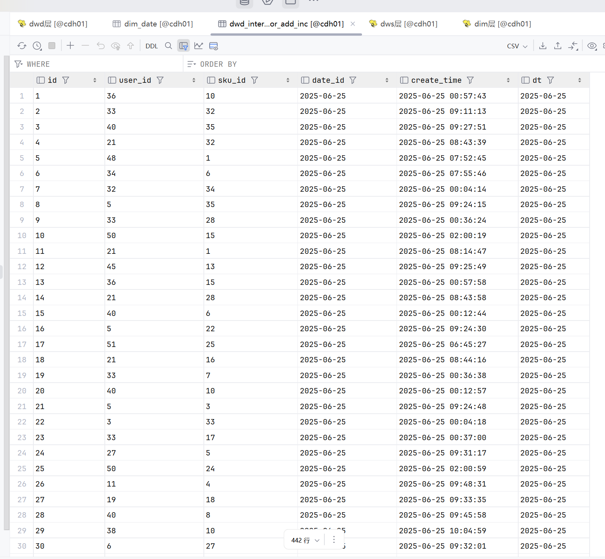
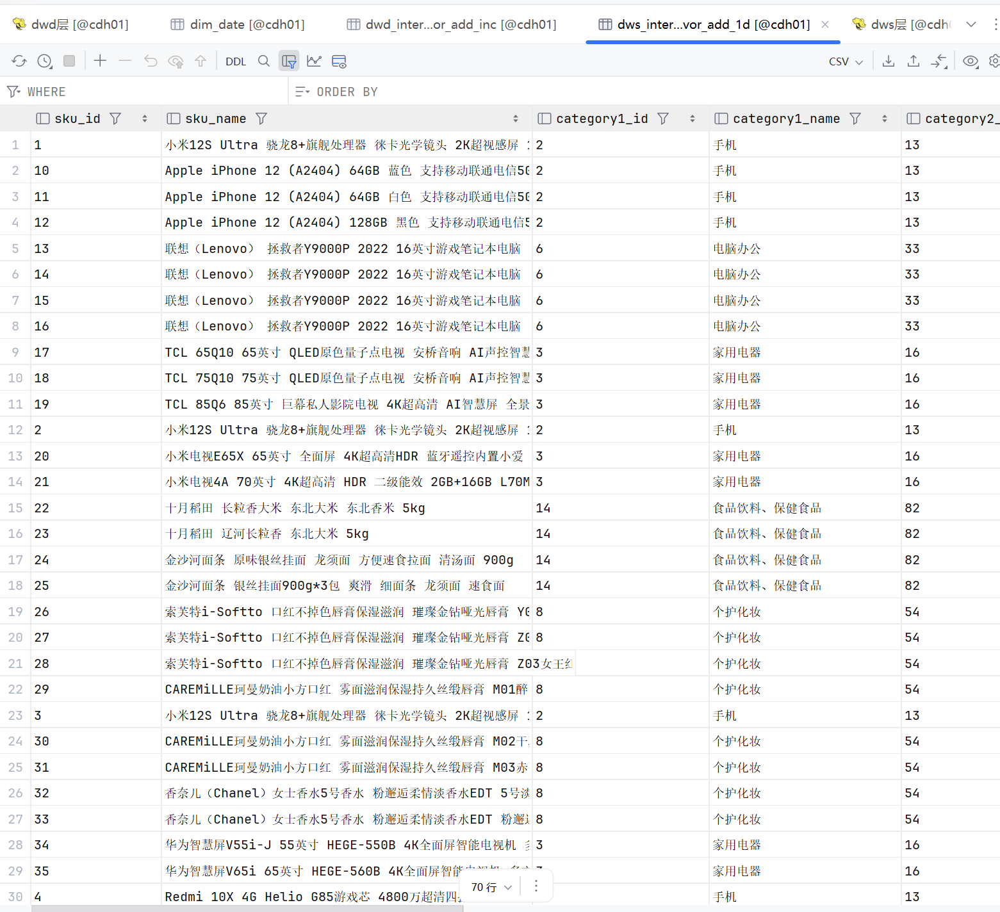
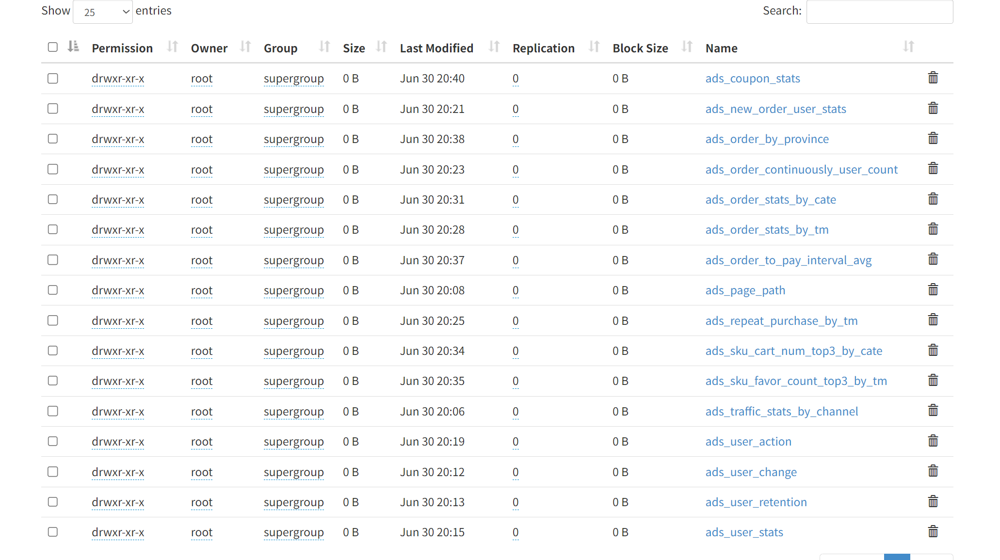

######崔江旗7.1日报
>
通过运行脚本以及conf文件和sql文件生成ods层，然后从hdfs读取出来写到hive里面
> 
在插入数据之前建立一个名为gmall的数据库，把所有数据存进去
> 
建立dim层并且在建表前面加上前缀可以吧dim层存放到dim层的数据库里
>如下图所示 
dim层为数据的维度层 主要存储的是时间、地点以及一些用户的属性
> dim层
>
建立dwd层并且建立数据表，通过一些sql查询以及需要的字段来查询一些数据
> dwd层
> dws层为汇总数据层 把一些主题以及维度对明细数据进行计算为ADS提供预计算的汇总数据，减少重复计算，加速报表查询
> dws层
> ADS层为应用数据层 根据业务做一些报表以及一些指标查询
> 